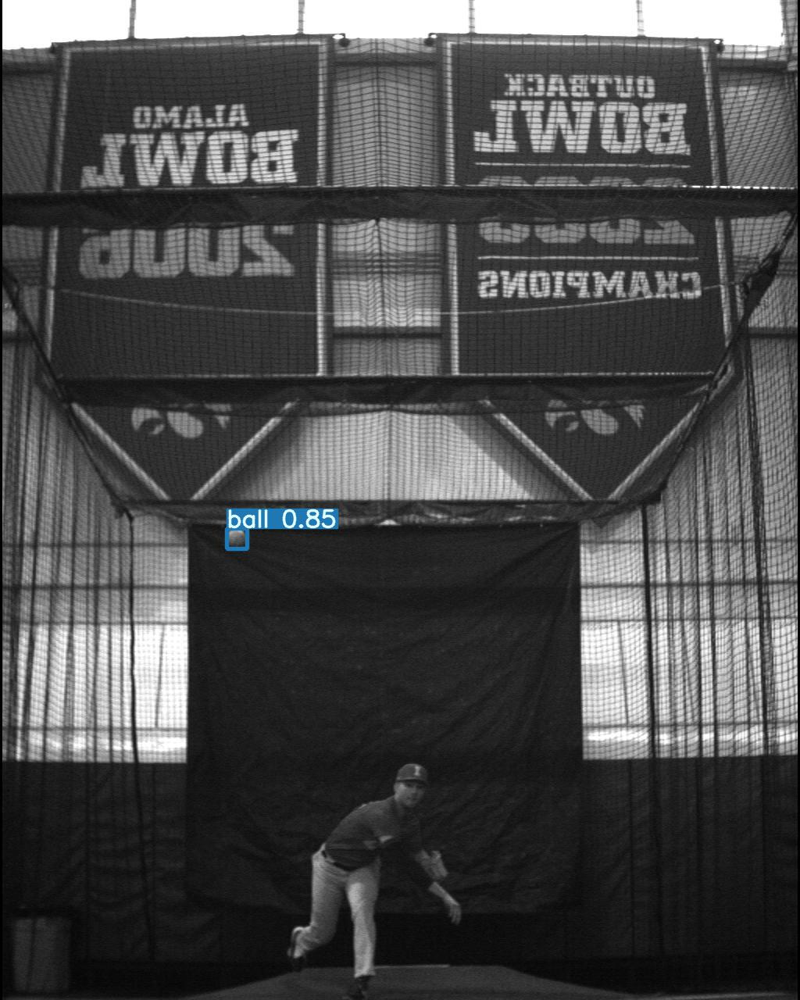
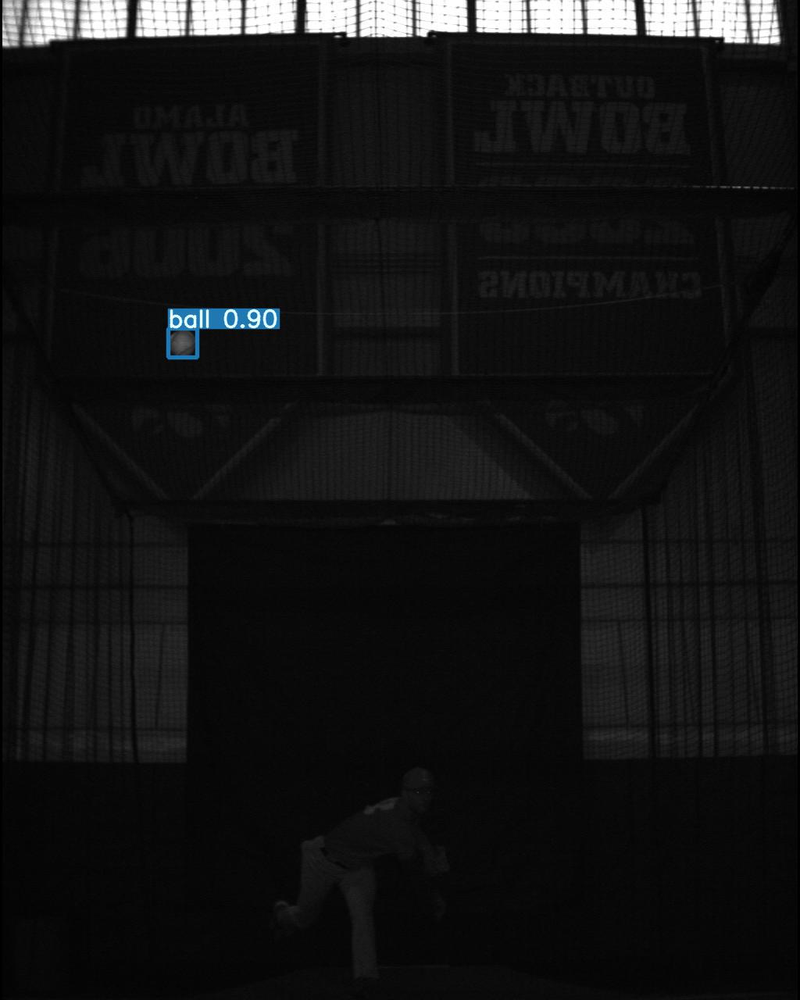
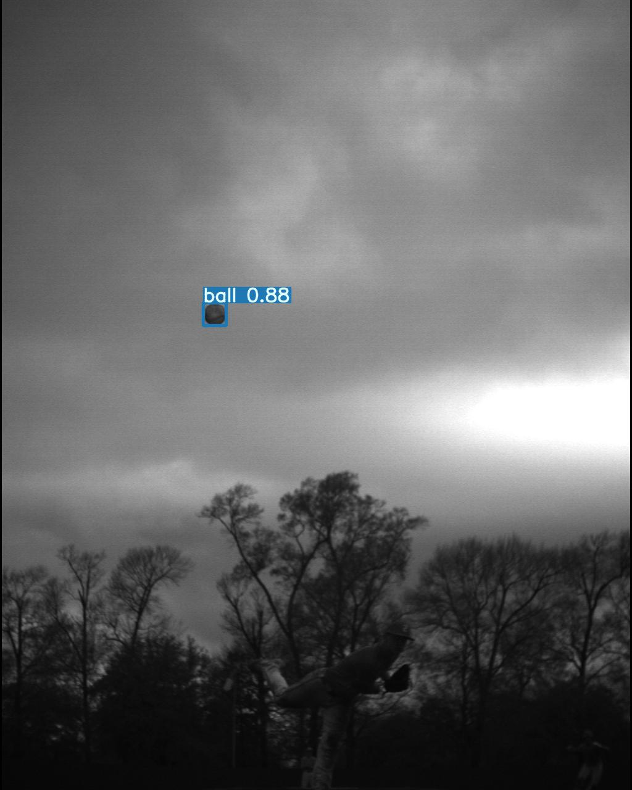
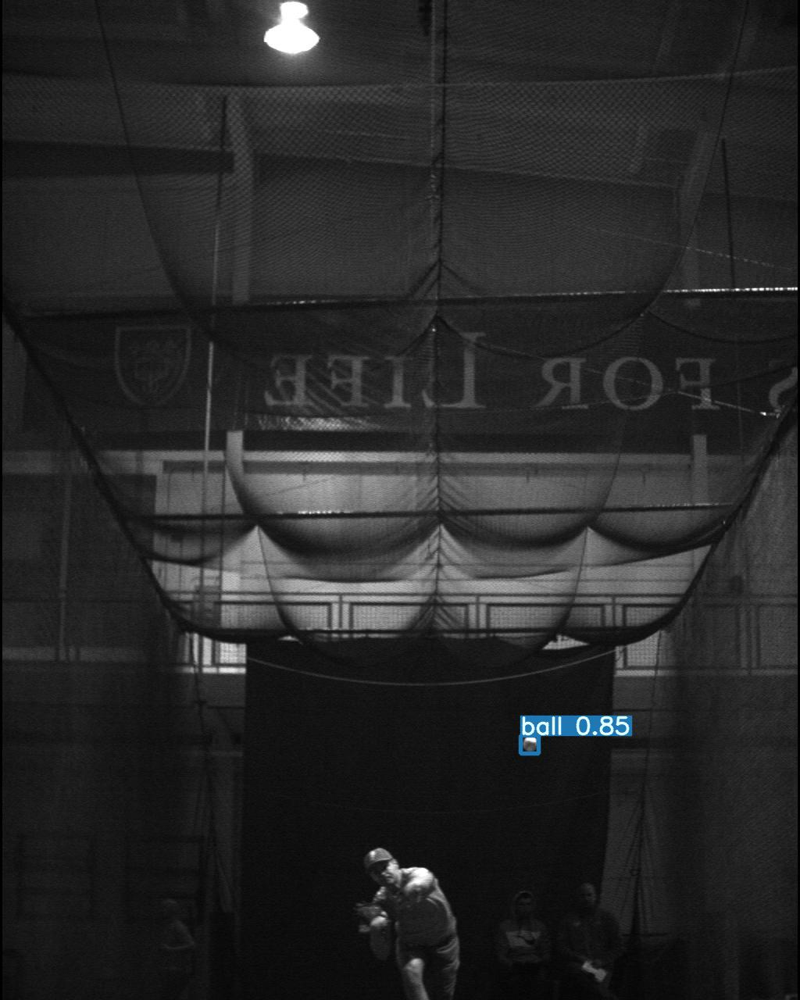
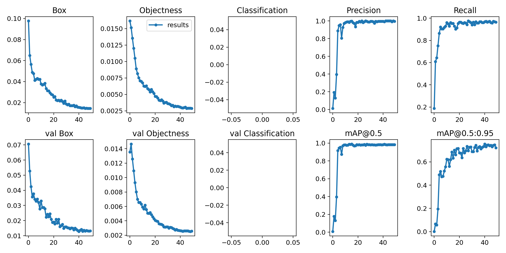

## Baseball Ball Detection

preprocessing.ipynb script allows me to create the desired data/folder structure to use train.py

    
    ├── train_data                  
      ├── images                    
         ├── train                    
         └── val                 

      ├── labels                    
         ├── train
         └── val


Here are some of the results of fine-tuning yolov5

|  | 
|:--:| 
| *Ball Detection 1* |


|  | 
|:--:| 
| *Ball Detection 2* |


|  | 
|:--:| 
| *Ball Detection 3* |


|  | 
|:--:| 
| *Ball Detection 4* |

|  | 
|:--:| 
| *Results* |

More results at results.zip

## Requirements

Python 3.8 or later with all [requirements.txt](https://github.com/ultralytics/yolov5/blob/master/requirements.txt) dependencies installed, including `torch>=1.7`. To install run:
```bash
$ pip install -r requirements.txt
```


## Tutorials
* [Train Custom Data](https://github.com/ultralytics/yolov5/wiki/Train-Custom-Data)&nbsp; 🚀 RECOMMENDED
* [Weights & Biases Logging](https://github.com/ultralytics/yolov5/issues/1289)&nbsp; 🌟 NEW
* [Multi-GPU Training](https://github.com/ultralytics/yolov5/issues/475)
* [PyTorch Hub](https://github.com/ultralytics/yolov5/issues/36)&nbsp; ⭐ NEW
* [ONNX and TorchScript Export](https://github.com/ultralytics/yolov5/issues/251)
* [Test-Time Augmentation (TTA)](https://github.com/ultralytics/yolov5/issues/303)
* [Model Ensembling](https://github.com/ultralytics/yolov5/issues/318)
* [Model Pruning/Sparsity](https://github.com/ultralytics/yolov5/issues/304)
* [Hyperparameter Evolution](https://github.com/ultralytics/yolov5/issues/607)
* [Transfer Learning with Frozen Layers](https://github.com/ultralytics/yolov5/issues/1314)&nbsp; ⭐ NEW
* [TensorRT Deployment](https://github.com/wang-xinyu/tensorrtx)


## Environments
- **Google Colab and Kaggle** notebooks with free GPU: <a href="https://colab.research.google.com/github/ultralytics/yolov5/blob/master/tutorial.ipynb"></a> <a href="https://www.kaggle.com/ultralytics/yolov5"></a>

## Training
Training times for YOLOv5s/m/l/x are 2/4/6/8 days on a single V100 (multi-GPU times faster). Use the largest `--batch-size` your GPU allows (batch sizes shown for 16 GB devices).
```bash
$ python train.py --img 640 --batch 16 --epochs 50 --data baseball.yaml --weights yolov5s.pt --nosave --cache
```

More information about inference, exporting, plotting can be found at  [ultralytics/yolov5](https://github.com/ultralytics/yolov5). The google colab link I shared makes everything so much easier, it's easy to follow.


## Inference

detect.py runs inference on a variety of sources, downloading models automatically from the [latest YOLOv5 release](https://github.com/ultralytics/yolov5/releases) and saving results to `runs/detect`.
```bash
$ python detect.py --source 0  # webcam
                            file.jpg  # image 
                            file.mp4  # video
                            path/  # directory
                            path/*.jpg  # glob
                            rtsp://170.93.143.139/rtplive/470011e600ef003a004ee33696235daa  # rtsp stream
                            rtmp://192.168.1.105/live/test  # rtmp stream
                            http://112.50.243.8/PLTV/88888888/224/3221225900/1.m3u8  # http stream
```


### PyTorch Hub

To run **batched inference** with YOLOv5 and [PyTorch Hub](https://github.com/ultralytics/yolov5/issues/36):
```python
import torch

# Model
model = torch.hub.load('ultralytics/yolov5', 'yolov5s')

# Images
dir = 'https://github.com/ultralytics/yolov5/raw/master/data/images/'
imgs = [dir + f for f in ('zidane.jpg', 'bus.jpg')]  # batch of images

# Inference
results = model(imgs)
results.print()  # or .show(), .save()
```

## Citation

[](https://zenodo.org/badge/latestdoi/264818686)
